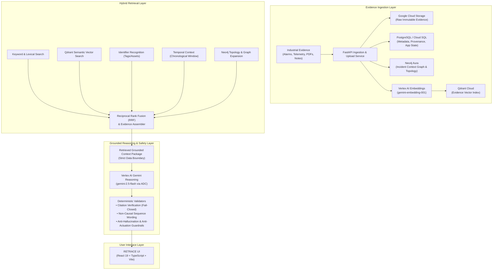

# RETRACE

**Industrial Incident Forensics**  
*Reconstruct. Replay. Learn.*

RETRACE is a multimodal industrial incident intelligence platform that reconstructs equipment incidents from fragmented operational evidence and provides evidence-grounded troubleshooting, incident replay, and counterfactual investigation. By unifying disparate plant data sources into an interconnected, queryable context, RETRACE enables reliability and maintenance teams to investigate equipment failures with end-to-end evidence provenance and strict safety boundaries.

The platform unifies fragmented industrial evidence across:
- **PLC / SCADA alarms** (alarm sequence logs, interlock trip triggers, digital state changes)
- **VFD / drive logs** (high-speed fault records, output frequency, current peaks, error codes)
- **Historian / time-series data** (pressure, flow rate, motor power, continuous vibration telemetry)
- **Engineering manuals and documents** (equipment OEM manuals, ISO vibration severity thresholds, design limits)
- **Maintenance / inspection records** (CMMS work orders, bearing lubrication history, shaft alignment sign-offs)
- **Technician observations** (shift handover notes, audible cavitation reports, field inspection entries)

---

## 1. The Problem

Industrial incidents rarely exist in one data source.

When critical plant machinery trips or degrades, the operational evidence is scattered across disparate industrial silos: SCADA historian servers, standalone VFD memory buffers, maintenance CMMS records, PDF engineering manuals, and technician field notes. Each system records a narrow slice of plant reality in different formats, sampling intervals, and coordinate systems.

Traditional incident troubleshooting requires reliability engineers to spend hours or days manually assembling and reconciling timelines across these disjointed systems. Under operational pressure to restart production, teams risk making premature causal assumptions or missing subtle warning indicators that preceded an interlock shutdown.

RETRACE creates an evidence-grounded incident context across these systems, enabling investigators to reconstruct, replay, and rigorously investigate the incident without hallucinated events or unverified causal leaps.

---

## 2. Core Capabilities

### Grounded Investigation Copilot
Evidence-grounded troubleshooting powered by hybrid multi-channel retrieval and Gemini reasoning. Every finding produced by the assistant is strictly validated against retrieved evidence citations (`EVD-...`), events (`EVT-...`), and assets.

Findings are rigorously classified under a deterministic **epistemic model**:
- `OBSERVED`: Facts supported directly by timestamped sensor logs, physical measurements, or signed records.
- `CORRELATED`: Clear temporal sequence or topological correlation across assets without proven causal linkage.
- `HYPOTHESIS`: Plausible engineering deductions requiring physical inspection or further diagnostic data to confirm.
- `UNKNOWN`: Critical missing information explicitly marked as unknown rather than guessed.

### Incident Replay
A deterministic chronological reconstruction of recorded evidence. Incident Replay steps through the exact timeline of logged events and sensor snapshots across electrical, mechanical, and control systems.

*Guarantees*: Incident Replay **does not** use Gemini to fabricate or interpolate intermediate events. It preserves factual recorded timestamps and explicitly avoids asserting unproven causality.

### Incident Context Graph
A Neo4j-backed graph representing assets, evidence artifacts, events, and their physical and topological relationships:
- `VFD-204 POWERS M-204`
- `M-204 DRIVES P-204`
- `P-204 MONITORED_BY PLC-204`

*Scope*: Topology relationships describe equipment connectivity and telemetry monitoring paths. They **do not** imply or assume causality.

### Potential Prevention Paths
"What Could Have Prevented It?" — An evidence-grounded counterfactual investigation module that identifies realistic operational opportunities where earlier intervention might have detected degradation, prompted timely inspection, or reduced incident severity.

*Guardrails*: Prevention paths are presented strictly as hypothetical opportunities. They **do not** claim guaranteed prevention, definitive root cause, or proven counterfactual certainty.

### Technician Troubleshooting Copilot
Interactive diagnostic assistant providing evidence-grounded answers, asset inspection checklists, and suggested investigative follow-ups.

*Safety*: Strictly advisory. The system contains no autonomous control paths and never issues live commands, overrides, or actuation instructions to plant machinery.

### Evidence Management
Multimodal evidence ingestion supporting CSV logs, PDF manuals, work orders, and field notes with full cryptographic SHA-256 integrity, raw object storage, metadata persistence, and retrieval eligibility controls.

---

## 3. System Architecture



---

## 4. Data Flow

1. **Evidence Ingestion**: Operational logs, SCADA alarms, PDF documentation, and shift records are submitted via the FastAPI ingestion endpoints.
2. **Raw Evidence Persisted**: Raw binary and text evidence files are stored immutably in Google Cloud Storage (or local storage during development).
3. **Metadata Extraction & Storage**: Deterministic extractors parse timestamps, sensor tags, file hashes (SHA-256), and file size, persisting records in PostgreSQL via SQLAlchemy 2.0.
4. **Graph Representation**: Assets, events, and evidence references are mapped into Neo4j Aura with topological relationships (`POWERS`, `DRIVES`, `MONITORED_BY`).
5. **Chunking & Embedding**: Evidence text is chunked into contextual units and transformed into 768-dimensional embeddings using Vertex AI (`gemini-embedding-001`).
6. **Vector Indexing**: Dense vectors and payload metadata are indexed in Qdrant collections.
7. **Hybrid Retrieval**: Queries execute across five parallel channels—semantic search, keyword matching, exact identifier recognition, temporal sequencing, and graph expansion—fused via Reciprocal Rank Fusion (RRF).
8. **Context Assembly**: Gemini receives **only** the assembled, retrieved context package inside a strict system boundary where evidence is treated purely as untrusted data. Gemini **never** connects directly to PostgreSQL, Neo4j, Qdrant, or Google Cloud Storage.
9. **Deterministic Post-Generation Validation**: Model outputs pass through server-side validators enforcing fail-closed citation verification, anti-actuation checks, and non-causal language rules.
10. **Delivery with Provenance**: Results are returned to the client UI with direct references to source evidence IDs (`EVD-...`), timestamps, and confidence ratings.

---

## 5. Technology Stack

| Technology | Purpose | Why It Is Used |
| :--- | :--- | :--- |
| **React 19** | Frontend user interface | Component-driven, responsive UI for timeline replay, investigation, and graph inspection |
| **TypeScript** | Static typing across frontend | Enforces strict type contracts between API schemas, components, and telemetry data |
| **Vite** | Frontend build tool | Fast local development tooling and optimized production SPA bundling |
| **Python 3.11** | Backend language runtime | Rich ecosystem for industrial data pipelines, vector client integrations, and validation |
| **FastAPI** | Backend web framework | High-performance asynchronous REST API with automatic OpenAPI validation and schemas |
| **Google Cloud Run** | Backend container hosting | Serverless, autoscaling container runtime running the FastAPI backend service |
| **Google Cloud Storage** | Raw evidence persistence | Durable, immutable cloud object storage for incoming logs, PDFs, and inspection notes |
| **PostgreSQL / Cloud SQL** | Relational metadata store | ACID-compliant relational source of truth for evidence records, audit logs, and app state |
| **SQLAlchemy 2.0 & Alembic** | Database ORM & migrations | Type-safe query construction and structured, reversible database schema migrations |
| **Neo4j Aura** | Graph database | Natural graph traversal over industrial asset topologies, electrical feeds, and event links |
| **Qdrant** | Vector search engine | Low-latency vector database for dense semantic retrieval of evidence embeddings |
| **Vertex AI / Gemini** | Multimodal reasoning & embeddings | High-fidelity grounded reasoning (`gemini-2.5-flash`) and embeddings (`gemini-embedding-001`) |
| **Pydantic 2.x** | Schema validation | Runtime request/response parsing, data boundary validation, and serialization |

---

## 6. Hybrid Retrieval

RETRACE avoids relying exclusively on vector search, which can miss exact industrial equipment tags or lose chronological relationships. Instead, it combines five complementary channels:

1. **Semantic Vector Retrieval**: Dense embedding search via Qdrant for natural language queries and cross-source semantic similarities.
2. **Keyword & Lexical Retrieval**: BM25-style lexical matching for operational codes, status flags, and specific alert phrases.
3. **Exact Identifier Recognition**: Regex-based extraction of known industrial asset tags (`VFD-204`, `P-204`, `M-204`), alarm codes (`ALM-P204-TRIP-VIB`, `W-2310`), and evidence IDs.
4. **Temporal Context**: Strict chronological windowing surrounding incident origin ($T_0$) to maintain operational sequence order.
5. **Incident Context Graph**: Neo4j topological expansion along upstream power, downstream drive, and instrumentation links.
6. **Reciprocal Rank Fusion (RRF)**: Merges ranked lists using standard rank-decay scoring ($k = 60$) into a single high-precision context package.

> **Note**: Vector similarity scores reflect retrieval relevance, not empirical confidence or operational certainty.

---

## 7. Grounding & Safety

RETRACE is engineered with defensive guardrails to ensure industrial decision safety:

- **Evidence Treated as Untrusted Data**: All evidence content is treated as untrusted runtime data, never as prompt instructions, mitigating prompt injection risks.
- **Fail-Closed Citation Validation**: Every assertion must cite retrieved evidence IDs (`EVD-...`), events (`EVT-...`), or known asset IDs. Invented IDs fail closed and trigger rejection or regeneration.
- **Strict Non-Causal Wording Rules**: The system prohibits asserting definitive causation (`"caused the failure"`, `"was the root cause"`) without direct physical proof, enforcing correlation and sequence terminology (`"was followed by"`, `"temporarily coincided with"`).
- **No Unsupported Engineering Theories**: The reasoning service rejects hypothetical physical mechanisms (e.g., internal impeller binding) unless explicitly documented in retrieved logs or inspection reports.
- **Prohibition of Direct Control**: Prompts and outputs strictly prohibit operational equipment commands (e.g., `"start drive"`, `"close breaker"`, `"override interlock"`).
- **Advisory Decision Support**: The platform maintains no autonomous control pathways to plant hardware. Operational authority remains entirely with human engineers.

### Epistemic Categorization
| Category | Definition | Example |
| :--- | :--- | :--- |
| **OBSERVED** | Factually recorded in verified logs or physical sensor readings | VFD-204 instantaneous current reached 268.4 A at 10:14:01.240 |
| **CORRELATED** | Statistically or temporally aligned across topological neighbors | Motor M-204 power surged 4 seconds after VFD-204 overcurrent warning |
| **HYPOTHESIS** | Plausible technical deduction requiring physical confirmation | Fluid cavitation may have induced mechanical impeller shudder |
| **UNKNOWN** | Relevant diagnostic information absent from recorded evidence | Suction strainer differential pressure at time of cavitation onset |

---

## 8. Demo Incident

### Incident Record: INC-2026-001
**Title**: Pump P-204 Unexpected Shutdown  
**Plant Area**: Process Area 2 (Chemical Train B)  
**Severity**: High  
**Initiation Time ($T_0$)**: `2026-09-08T10:14:01Z`  

### Incident Summary
High-pressure centrifugal slurry pump P-204 tripped unexpectedly following an overcurrent cascade initiating at drive VFD-204, leading to process disruption in Chemical Train B.

### Integrated Evidence Artifacts
- **`EVD-001` (VFD / Drive Logs)**: `VFD_204_Log.csv` — Drive data logger recording Overcurrent Warning W-2310 and 268.4 A instantaneous current spike at 10:14:01.240.
- **`EVD-002` (PLC / SCADA)**: `SCADA_Alarm_Log.csv` — Central SCADA archive capturing Alarm Seq #88310 (`ALM-P204-TRIP-VIB`), vibration at 9.2 mm/s, and interlock `04-SHUTDOWN`.
- **`EVD-003` (Historian Data)**: `Historian_P204.csv` — 1 Hz process telemetry recording discharge pressure dropping from 6.8 bar to 4.2 bar between 10:14:08 and 10:14:15.
- **`EVD-004` (Engineering Documents)**: `Pump_P204_Manual.pdf` — OEM manual section 6.4 citing ISO 10816-3 Category Class II limits (trip threshold 7.1 mm/s RMS).
- **`EVD-005` (Maintenance / Inspection)**: `Maintenance_M204_Report.pdf` — CMMS Work Order #WO-88492 documenting bearing lubrication and +0.08 mm angular shaft offset 25 days prior.
- **`EVD-006` (Technician Notes & Photos)**: `Technician_Observation_001` — Operations shift note reporting audible rattling and 0.8 bar suction reading 10 seconds before trip.

---

## 9. Repository Structure

```
/
├── backend/
│   ├── alembic/                      # Database migrations (PostgreSQL)
│   │   ├── env.py                    # Dynamic DATABASE_URL configuration
│   │   └── versions/                 # Versioned migration scripts
│   ├── app/
│   │   └── main.py                   # FastAPI app entry point & health check endpoints
│   ├── api/                          # Modular API route controllers
│   │   ├── incidents.py              # Incidents, events, context, and prevention routes
│   │   ├── evidence.py               # Evidence retrieval and multipart upload routes
│   │   └── investigation.py          # Grounded troubleshooting query endpoints
│   ├── core/
│   │   └── config.py                 # Pydantic Settings & environment variable configuration
│   ├── database/                     # SQLAlchemy models and session engine
│   ├── graph/                        # Neo4j driver, connectivity, and health checks
│   ├── repositories/                 # Repository layer (PostgreSQL & in-memory fallback)
│   ├── schemas/                      # Pydantic data schemas
│   ├── services/                     # Core intelligence and forensic services
│   │   ├── grounded_investigation_service.py # Gemini reasoning & citation validation
│   │   ├── hybrid_retrieval_service.py       # Multi-channel RRF retrieval
│   │   ├── incident_replay_service.py        # Deterministic chronological replay
│   │   ├── prevention_service.py             # Grounded counterfactual prevention paths
│   │   ├── context_graph_service.py          # Neo4j graph traversal and enrichment
│   │   ├── evidence_storage.py               # Immutable storage (GCS / local)
│   │   └── upload_service.py                 # Upload orchestration & consistency rollback
│   ├── vector/                       # Qdrant vector client, embeddings, and chunking
│   ├── data/                         # Baseline synthetic mock incident dataset
│   ├── tests/                        # Comprehensive unit and integration test suite
│   ├── Dockerfile                    # Container definition for Cloud Run deployment
│   ├── requirements.txt              # Python package dependencies
│   ├── .env.example                  # Backend environment variable template
│   └── README.md                     # Backend-specific architecture & setup guide
├── src/
│   ├── components/                   # Modular React UI components
│   │   ├── common/                   # Shared badges, logos, and status indicators
│   │   ├── dashboard/                # Main incident intelligence overview
│   │   ├── evidence/                 # Evidence repository viewer & upload modal
│   │   ├── graph/                    # Interactive Neo4j Incident Context Graph
│   │   ├── incidents/                # Incident selector and metadata viewer
│   │   ├── investigation/            # Grounded Technician Troubleshooting Copilot
│   │   ├── layout/                   # Header, Navigation Sidebar, and telemetry badges
│   │   ├── prevention/               # Counterfactual Prevention Paths interface
│   │   └── replay/                   # Deterministic step-by-step incident replay player
│   ├── services/                     # Frontend API client and service wrappers
│   ├── types/                        # TypeScript type definitions and interfaces
│   ├── App.tsx                       # Main application shell and view state manager
│   ├── main.tsx                      # Vite React application entry point
│   └── index.css                     # Tailwind CSS styling entry point
├── public/                           # Static assets
├── package.json                      # Frontend dependencies and npm scripts
├── vite.config.ts                    # Vite configuration
├── tsconfig.json                     # TypeScript compiler configuration
├── metadata.json                     # Application platform metadata
├── .env.example                      # Frontend environment variable template
└── README.md                         # Project overview and system documentation (this file)
```

---

## 10. Run Locally

### Prerequisites
- **Node.js** (v18 or newer) and **npm**
- **Python** (v3.10 or newer) and `pip`
- Google Cloud credentials (when connecting to live Vertex AI, Cloud Storage, or Cloud SQL)

---

### Frontend Setup

1. From the repository root, install dependencies:
   ```bash
   npm install
   ```

2. Start the Vite development server:
   ```bash
   npm run dev
   ```
   *The frontend runs by default on `http://localhost:3000`.*

3. Frontend Build & Typecheck:
   ```bash
   npm run lint     # Runs tsc --noEmit
   npm run build    # Produces production distribution in dist/
   ```

**Frontend Environment**:
Configure the backend connection via `.env` (or copy `.env.example`):
```env
VITE_RETRACE_API_URL=http://localhost:8000
```

---

### Backend Setup

1. Navigate to the `backend/` directory:
   ```bash
   cd backend
   ```

2. Create and activate a Python virtual environment:
   ```bash
   python3 -m venv venv
   source venv/bin/activate    # On Windows: venv\Scripts\activate
   ```

3. Install required Python packages:
   ```bash
   pip install -r requirements.txt
   ```

4. Configure local environment variables:
   ```bash
   cp .env.example .env
   ```

5. Start the FastAPI backend server:
   ```bash
   uvicorn backend.app.main:app --host 0.0.0.0 --port 8000 --reload
   ```
   *Or run directly via Python from the backend folder:*
   ```bash
   python -m uvicorn app.main:app --host 0.0.0.0 --port 8000 --reload
   ```

6. Interactive API documentation is available at:
   - Swagger UI: `http://localhost:8000/docs`
   - ReDoc: `http://localhost:8000/redoc`

---

## 11. Environment Variables

The backend and frontend are configured through environment variables. Credentials and secrets are managed via Google Secret Manager or local `.env` files and are never committed to version control.

| Variable Name | Component | Description |
| :--- | :--- | :--- |
| `ENVIRONMENT` | Backend | Runtime environment mode (`development` or `production`) |
| `PORT` | Backend | Server port (default `8000`, injected dynamically on Cloud Run) |
| `HOST` | Backend | Server bind address (default `0.0.0.0`) |
| `CORS_ORIGINS` | Backend | Comma-separated list of allowed CORS origins |
| `GCS_BUCKET_NAME` | Backend | Google Cloud Storage bucket for immutable raw evidence files |
| `DATABASE_URL` | Backend | PostgreSQL connection URL for evidence metadata persistence |
| `NEO4J_URI` | Backend | Neo4j Aura bolt/neo4j connection URI |
| `NEO4J_USERNAME` | Backend | Neo4j database username |
| `NEO4J_PASSWORD` | Backend | Neo4j database password |
| `NEO4J_DATABASE` | Backend | Neo4j database name (optional) |
| `QDRANT_URL` | Backend | Qdrant Cloud or self-hosted vector database endpoint |
| `QDRANT_API_KEY` | Backend | Qdrant API key |
| `QDRANT_COLLECTION` | Backend | Qdrant vector collection name (default `retrace_evidence_v1`) |
| `QDRANT_VECTOR_SIZE` | Backend | Embedding vector dimension (default `768`) |
| `GOOGLE_CLOUD_PROJECT` | Backend | Google Cloud project ID for Vertex AI and GCS access |
| `GOOGLE_CLOUD_LOCATION` | Backend | Google Cloud region for Vertex AI models (e.g. `us-central1`) |
| `EMBEDDING_MODEL` | Backend | Vertex AI multimodal embedding model (e.g. `gemini-embedding-001`) |
| `EMBEDDING_DIMENSION` | Backend | Embedding output vector dimension (e.g. `768`) |
| `REASONING_MODEL` | Backend | Vertex AI reasoning model for grounded investigation (e.g. `gemini-2.5-flash`) |
| `REASONING_LOCATION` | Backend | Region for Vertex AI reasoning model (e.g. `us-central1`) |
| `VITE_RETRACE_API_URL` | Frontend | Base HTTP/HTTPS URL of the RETRACE FastAPI backend |

---

## 12. Cloud Deployment

### Frontend Deployment
The frontend is hosted and served as a high-performance single-page web application within Google AI Studio / Google Cloud Run, communicating securely over HTTPS with the backend API.

### Backend Deployment (Google Cloud Run)
The FastAPI backend is packaged using the lightweight multi-stage `backend/Dockerfile` (`python:3.11-slim`) and deployed directly to Google Cloud Run:
```bash
cd backend
gcloud run deploy retrace-api \
  --source . \
  --region us-central1 \
  --allow-unauthenticated \
  --set-env-vars ENVIRONMENT=production
```

### Persistence & Managed Services
- **Relational Metadata**: Cloud SQL for PostgreSQL, managed with Alembic migrations.
- **Raw Evidence Storage**: Google Cloud Storage bucket with immutable object retention.
- **Incident Context Graph**: Neo4j Aura cloud instance for topological traversal.
- **Vector Retrieval**: Qdrant Cloud managed vector database for dense semantic embeddings.
- **Reasoning & Embeddings**: Google Cloud Vertex AI leveraging Application Default Credentials (ADC) without client-side API keys.
- **Secret Management**: Sensitive parameters (`DATABASE_URL`, `NEO4J_PASSWORD`, `QDRANT_API_KEY`) are managed via Google Secret Manager and mounted as environment variables in Cloud Run.

---

## 13. Health Check

The backend exposes a comprehensive health check endpoint:

```http
GET /health
```

**Sample Response:**
```json
{
  "status": "healthy",
  "service": "RETRACE API",
  "database": "connected",
  "graph": "connected",
  "vector": "connected"
}
```

Granular subsystem health checks are also available:
- `GET /health/database`: Verifies PostgreSQL engine and connection pool responsiveness.
- `GET /health/graph`: Verifies Neo4j Aura connectivity and session readiness.
- `GET /health/vector`: Verifies Qdrant collection status and cluster health.

---

## 14. Testing

The repository includes an extensive automated backend test suite covering grounding, citations, safety validation, vector retrieval, and deterministic replay.

### Running Backend Tests
Execute unit and integration tests using Python's standard test runner or `pytest`:

```bash
# Run all tests using unittest
python3 -m unittest discover backend/tests

# Or run using pytest
pytest backend/tests/
```

### Test Coverage Areas
- **Grounding & Citations** (`test_grounded_investigation.py`, `test_grounding_hardening.py`): Verifies fail-closed citation validation, anti-hallucination guardrails, and non-causal language enforcement.
- **Incident Replay** (`test_incident_replay.py`): Verifies deterministic chronological event ordering, timestamp preservation, and non-generative reconstruction.
- **Prevention Paths** (`test_prevention.py`): Verifies counterfactual wording rules, hypothetical intervention guardrails, and citation tracking.
- **Context Graph** (`test_graph.py`): Tests Neo4j connectivity, topology relationship mapping, and graph context expansion.
- **Retrieval & Vector Search** (`test_hybrid_retrieval.py`, `test_vector.py`, `test_retrieval_eligibility.py`): Tests RRF fusion, keyword matching, tag recognition, and artifact eligibility filtering.
- **API & Repositories** (`test_api.py`, `test_repository.py`, `test_ingestion.py`): Tests FastAPI endpoints, error handling, metadata persistence, and rollback behavior.

---

## 15. Public Demo Safety

> **Public Demonstration Notice**  
> This deployment is a demonstration prototype developed for technical evaluation and research.  
> 
> - **Evidence Deletion**: Evidence artifact deletion is intentionally disabled in the public demonstration deployment to preserve audit logs and ensure consistent reproducibility for reviewers.  
> - **Advisory Decision Support**: The platform is strictly an advisory investigation aid. It contains no machinery control hooks, overrides, or automated actuation capabilities, and must not be used to autonomously operate industrial equipment.

---

## 16. Design Principles

1. **Evidence before inference**: Ground every observation in recorded telemetry, logs, or physical inspection documentation before formulating conclusions.
2. **Correlation is not causation**: Temporal sequence or asset proximity across equipment does not prove a causal root cause.
3. **Missing information remains unknown**: When data is absent from available evidence, the system explicitly acknowledges the gap as `UNKNOWN` rather than guessing.
4. **Traceable factual conclusions**: Every finding must maintain complete provenance linking back to original evidence identifiers, timestamps, and confidence ratings.
5. **Human operational authority**: AI models assist the investigation process; human engineers retain ultimate operational and safety authority.

---

## 17. Project Status

| Capability | Status | Implementation Details |
| :--- | :--- | :--- |
| **Grounded Investigation** | Verified | Multi-channel RRF retrieval, Gemini 2.5 Flash reasoning, fail-closed citation validation |
| **Incident Replay** | Verified | Deterministic chronological event reconstruction without generative fabrication |
| **Incident Context Graph** | Verified | Neo4j Aura graph topology modeling assets, alarms, events, and evidence |
| **Hybrid Retrieval** | Verified | Dense vector search (Qdrant), keyword search, tag recognition, and RRF rank fusion |
| **Potential Prevention Paths** | Verified | Evidence-grounded counterfactual scenarios with strict hypothetical guardrails |
| **Technician Troubleshooting Copilot** | Verified | Interactive advisory assistant providing diagnostic suggestions and missing data checklists |
| **Evidence Provenance & Ingestion** | Verified | Multi-format upload, SHA-256 integrity hashing, GCS storage, and PostgreSQL metadata |
| **Grounding & Safety Validators** | Verified | Server-side validation enforcing non-causal language and anti-actuation rules |
| **Cloud Deployment** | Verified | Containerized Google Cloud Run backend with Cloud SQL, GCS, Neo4j, and Qdrant |

---

## 18. Additional Documentation

For detailed backend-specific setup, Alembic migration workflows, repository interfaces, and upload consistency mechanics, refer to the backend documentation:

- [Backend Documentation](backend/README.md)
- [Cloud Run Deployment Guide](backend/CLOUD_RUN_DEPLOY.md)
